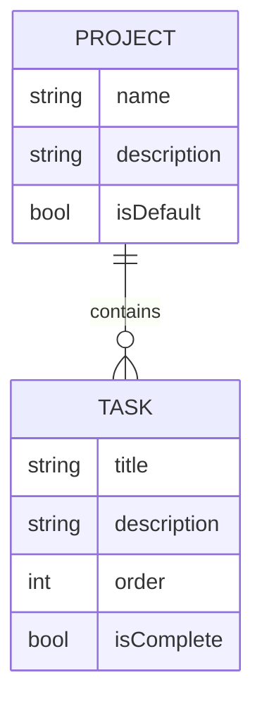
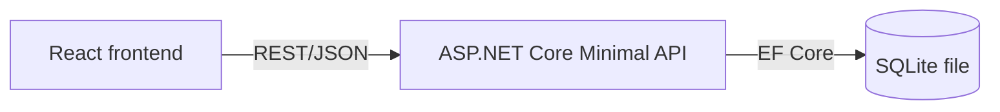
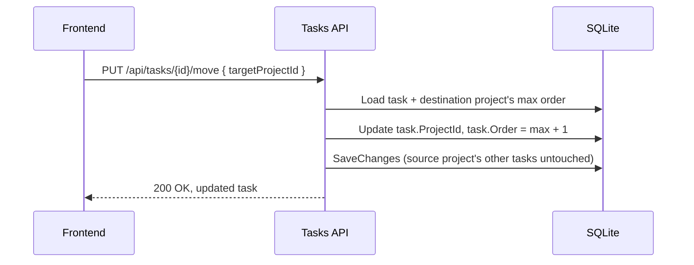

# Todo Task Management App - Plan

## Goal Capsule

- **Objective:** Ship a production-minded MVP to-do task management app (API + frontend) for Ezra's take-home, demonstrating clear architecture, deliberate scope judgment, and production-readiness practices rather than raw feature volume.
- **Product authority:** This document. The take-home brief in `docs/original_instructions.md` is the external constraint source (tech stack, submission format).
- **Product Contract preservation:** R1-R17 unchanged from the brainstorm. The three Outstanding Questions the brainstorm deferred to planning (completed-task display, move-to-project mechanism, field-length limits) are now resolved below and removed from Outstanding Questions.
- **Open blockers:** None — implementation-ready.

## Product Contract

### Summary

A single-user, no-login to-do app: tasks (title, description) live inside projects (name, description), including a seeded, undeletable default "Inbox" project for anything not explicitly organized. Tasks can be manually reordered within a project and moved between any projects, Inbox included. Checking a task off completes it rather than deleting it; deleting a non-default project cascades to delete its tasks, gated by a confirmation dialog. Production-facing basics — API docs, centralized error handling, structured logging, seed data, and tests — are built in from the start, not treated as stretch goals.

### Problem Frame

Ezra's take-home is deliberately lightly scoped: "build a to-do task management API and frontend," with an explicit instruction to "add any features you feel are required for a Production MVP." The evaluation is less about the CRUD surface and more about how a candidate interprets an underspecified prompt — what gets included, what gets deliberately cut, and whether production concerns (tests, logging, security, scalability reasoning) are treated as first-class rather than an afterthought. The two failure modes the brief calls out directly are minimal scaffolding with no real thought, and over-engineering a simple prompt. This document exists to fix a scope that avoids both.

### Key Decisions

- **Single user, no authentication.** No login, no multi-tenancy. This is a deliberate scope cut, not an oversight, and is called out explicitly as a trade-off rather than left implicit.
- **Feature scope caps at organization, not scheduling.** Checkoff-to-complete, description, projects, manual reordering, and moving tasks between projects are in. Due dates, scheduling, recurrence, and reminders are out entirely — not a time-permitting stretch, but dropped as disproportionate complexity for this MVP.
- **Manual order is the prioritization mechanism, not a separate priority field.** Reordering lets the user sequence tasks in the order they should actually be done — that ordering *is* the prioritization signal, so a standalone priority field was cut as redundant with it.
- **Inbox is a real, seeded, undeletable default project — not a null-project sentinel.** Every task always belongs to a real project row. This keeps move/reorder/delete logic uniform (moving a task to Inbox is the same operation as moving it to any other project) at the cost of one guard preventing the default project's deletion.
- **Project deletion cascades to its tasks**, gated by a confirmation dialog in the UI before the destructive action executes. Simpler data model than orphaning tasks to Inbox, offset by the confirmation step.
- **Data persists across restarts** (a real database file), not an in-memory store that resets on every run — closer to how a real deployment behaves and avoids looking like a bug to a reviewer restarting the app.
- **Production-readiness is treated as core scope, not stretch.** API documentation, centralized error handling, structured logging, seed data, and automated tests are committed requirements, sized to match Ezra's stated grading criteria rather than generic polish.



Every `TASK` belongs to exactly one `PROJECT`; the `PROJECT` flagged `isDefault` is the seeded Inbox and cannot be deleted.

### Requirements

**Task management**

- R1. A task has a title and an optional description.
- R2. A task belongs to exactly one project at all times, including the default Inbox project.
- R3. A task can be created, edited, and deleted.
- R4. Checking a task off marks it complete and records a completion timestamp; it is not deleted.
- R5. A task can be moved from its current project to any other project, including Inbox.
- R6. Tasks can be manually reordered within a project; order is scoped per project.

**Project management**

- R7. A project has a name and a description.
- R8. Exactly one default "Inbox" project is seeded automatically and cannot be deleted.
- R9. A project other than the default Inbox can be created, edited, and deleted.
- R10. Deleting a project deletes all of its tasks; the user must confirm the action via a dialog before it executes.

**Data & persistence**

- R11. Task and project data persists across API restarts.

**Production readiness**

- R12. The API exposes interactive documentation of its endpoints.
- R13. The API returns a consistent error response shape for validation failures and unhandled errors, via centralized error handling.
- R14. The API emits structured logs sufficient to trace a request, including a correlation identifier.
- R15. The system ships with seed data so a fresh install has example projects and tasks to explore.
- R16. The codebase includes automated tests (unit and integration) covering core task and project behavior.
- R17. Task and project text fields (title, name, description) have explicit required-ness and max-length constraints; violations return a validation error via the R13 error contract.

### Key Flows

- F1. Move a task to another project
  - **Trigger:** User assigns an existing task to a different project.
  - **Steps:** The task's project reference updates; it is appended to the destination project's order; the source project's remaining tasks keep their relative order.
  - **Covered by:** R5, R6

- F2. Delete a project
  - **Trigger:** User requests deletion of a non-default project.
  - **Steps:** UI shows a confirmation dialog before proceeding; on confirm, the project and all its tasks are deleted together; on cancel, nothing changes.
  - **Covered by:** R9, R10

- F3. Complete a task
  - **Trigger:** User checks off an incomplete task.
  - **Steps:** The task is marked complete with a completion timestamp and remains in the system rather than disappearing.
  - **Covered by:** R4

### Acceptance Examples

- AE1. Covers R4.
  - **Given** a task that is not yet complete
  - **When** the user checks it off
  - **Then** the task is marked complete with a completion timestamp and remains in the system

- AE2. Covers R9, R10.
  - **Given** a non-default project with tasks in it
  - **When** the user deletes the project and confirms the dialog
  - **Then** the project and all of its tasks are removed
  - **Given** the user instead cancels the confirmation dialog
  - **Then** nothing is deleted

- AE3. Covers R8.
  - **Given** the default Inbox project
  - **When** the user attempts to delete it
  - **Then** the system prevents the deletion

### Scope Boundaries

- Due dates, scheduling, recurrence, and reminders — dropped entirely, not deferred as a stretch goal.
- Authentication and multi-user support — single unauthenticated user only.
- Nested sub-projects or sub-tasks — projects and tasks stay flat.
- Optimistic updates, concurrency tokens, and ETags — the pessimistic refetch model is coherent for single-user and documented as such.
- Explicit transactions around reorder/move — each mutation is already one `SaveChangesAsync`, i.e. one implicit transaction.
- Environment-gating Swagger, a menu-button replacement for the move dropdown, and a full focus trap in `ConfirmDialog` (a minimal Escape/autofocus version covers the realistic interaction) — each a deliberate choice made once and documented rather than revisited.
- Per-field error objects / `aria-describedby`, client-side `maxLength` attributes (their absence is what lets server-validation surfacing demo), hover-reveal row actions, dark mode, mobile breakpoints, client-generated correlation IDs, and disabling drag-and-drop while a reorder is pending — all judged as diminishing returns beyond this MVP's scope.

### Dependencies / Assumptions

- Backend stack (.NET Core, EF Core, SQLite) and frontend framework (React) are fixed inputs from the take-home brief, not open decisions.
- Assumes a single-instance deployment; no horizontal-scaling or multi-instance concerns apply to this MVP (informs the scalability write-up rather than the implementation itself).

---

## Planning Contract

No external or repo research was dispatched: the repository is greenfield (only `docs/` exists), and ASP.NET Core Web API + EF Core + SQLite + React is an established, well-documented stack that doesn't hinge on any unsettled or niche technical choice a web scan would inform.

### Key Technical Decisions

- **ASP.NET Core Minimal APIs, not Controller classes.** Functionally equivalent for this scope (parse request, call the operation, shape the response) but less boilerplate, and the current idiomatic default for a new .NET API.
- **No repository/unit-of-work layer over EF Core, and no injected service classes.** Business logic (validation, cascade-delete guard, reorder, move) lives in plain static functions grouped per entity (`ProjectOperations`, `TaskOperations`) that take `AppDbContext` directly. This gets the reuse-across-endpoints and test-without-HTTP benefits a service layer would provide, without the class/interface/DI ceremony — a repository or injected-service abstraction would add indirection with no behavioral benefit for a single-datastore MVP.
- **SQLite foreign-key enforcement must be explicitly enabled** (`Foreign Keys=True` in the connection string, equivalent to `PRAGMA foreign_keys = ON`). Unlike Postgres, SQLite has FK enforcement off by default per connection. EF Core's cascade-delete reaches the database (rather than just cascading in-memory for already-tracked entities) only when a project's tasks aren't currently loaded into the `DbContext` — and that exact path silently leaves orphaned task rows if FK enforcement isn't on, with no error. This is load-bearing for R10 and is explicitly tested (see U1) against a real SQLite connection, not EF Core's InMemory provider, because InMemory doesn't model foreign-key or cascade behavior at all.
- **Reordering resends the full ordered task-ID list per project on every drag; the backend renumbers sequentially (0..n-1).** Simpler than a single-item move-with-reindex endpoint and avoids fractional-index bookkeeping; acceptable at single-user scale.
- **Move-to-project is a dropdown action per task, not cross-project drag-and-drop.** The API contract (`PUT /api/tasks/{id}/move`) is identical either way, so upgrading to drag-and-drop later only touches the frontend interaction layer, not the backend.
- **Logging uses built-in ASP.NET Core `ILogger` with structured message templates, plus a correlation-ID middleware** (reads `X-Correlation-Id` or generates one, attaches it to the logging scope, echoes it in the response). Satisfies R14 without a new dependency; Serilog would be a cheap later addition for richer sinks, not required now.
- **Errors use ASP.NET Core's built-in `ProblemDetails` type**, via a global exception-handling middleware, rather than a custom error shape — framework-native, satisfies R13.
- **Integration tests use a real SQLite database (temp file or an open `:memory:` connection), not EF Core's InMemory provider** — InMemory doesn't enforce foreign keys or cascade behavior, which is exactly what R10's cascade-delete needs verified.
- **Frontend server state uses React Query (`@tanstack/react-query`)** instead of hand-rolled fetch/useState — removes loading/error/caching boilerplate without introducing a heavier state library the app's size doesn't need.
- **Drag-and-drop reordering uses `@dnd-kit/core`.** Well-maintained, purpose-built for single-list sortable reordering with reasonable accessibility defaults out of the box — appropriate for this MVP's scope without pulling in a heavier drag-and-drop framework.
- **Mutations use pessimistic UI updates, not optimistic-with-rollback.** The task/project list doesn't reflect a create, edit, delete, move, or reorder until the mutation succeeds; any failure (validation or otherwise) surfaces via a toast/banner showing the error. Simpler to implement correctly than optimistic updates with rollback, at the cost of a small perceived-latency hit that's an acceptable trade for an MVP.
- **Concurrent write races map to 409, not 500.** A `DbUpdateException` caught in `ExceptionHandlingMiddleware` (rather than pre-checking existence a second time before every mutation) covers move/reorder/delete races in one place — cheaper than closing every check-then-act window individually, and gives the client an actionable status code instead of an opaque server error.
- **Correlation-ID logging requires `IncludeScopes: true` on the console logger.** `ILogger.BeginScope` alone doesn't surface the scope in console output — the formatter has to be told to include it, or the correlation ID attaches to every log call but appears in none of them. Easy to miss since the middleware and its header-echo test both pass without it.
- **Shared `.btn--primary` / `.btn--secondary` CSS classes, applied at every button call site** (including the dialog's buttons) instead of relying on browser-default button styling for some actions and custom styling for others — one visual language for all interactive controls rather than a partially-applied one.

### Assumptions

- Completed tasks display inline within their project view (struck through), sorted to the bottom, rather than moving to a separate/filtered view.
- Task title and project name are required, max 200 characters; task description and project description are optional, max 2000 characters (resolves R17's exact limits).
- This is a local/dev-oriented app given the no-auth design; it is not intended for public internet exposure. The README states this explicitly rather than leaving it implicit.

### High-Level Technical Design



The move-to-project flow is the least obvious behavior in the plan (flagged independently by three reviewers during requirements review), so it's worth spelling out as a sequence rather than prose alone:



### Output Structure

```text
backend/
  TodoApi/
    TodoApi.csproj
    Program.cs
    Data/
      AppDbContext.cs
      DbSeeder.cs
      Migrations/
    Models/
      Project.cs
      TaskItem.cs
    Operations/
      ProjectOperations.cs
      TaskOperations.cs
    Dtos/
      ProjectDtos.cs
      TaskDtos.cs
    Endpoints/
      ProjectEndpoints.cs
      TaskEndpoints.cs
    Validation/
      FieldValidation.cs
    Middleware/
      ExceptionHandlingMiddleware.cs
      CorrelationIdMiddleware.cs
  TodoApi.Tests/
    TodoApi.Tests.csproj
    DataModelTests.cs
    ProjectEndpointsTests.cs
    TaskEndpointsTests.cs
    DbSeederTests.cs
    Middleware/

frontend/
  package.json
  vite.config.ts
  src/
    main.tsx
    App.tsx
    api/
      client.ts
      types.ts
    components/
      Layout.tsx
      ProjectSidebar.tsx
      NewProjectForm.tsx
      ConfirmDialog.tsx
      TaskList.tsx
      TaskItem.tsx
      NewTaskForm.tsx
      Toast.tsx
      *.test.tsx (colocated)
```

### Risks & Dependencies

- **Silent cascade-delete failure.** SQLite's off-by-default FK enforcement could silently no-op R10's cascade-delete if the pragma is missed. Mitigated by KTD (explicit enable) plus a dedicated integration test against a real SQLite connection (U1).
- **No-auth exposure risk.** The app must not be deployed publicly as-is. Mitigated by documenting the local/dev-only assumption in the README (U9).
- No external service dependencies beyond standard NuGet/npm packages named in the Key Technical Decisions above.

---

## Implementation Units

### U1. Backend project scaffolding and data model

**Goal:** Set up the ASP.NET Core Web API project and the EF Core data model (`Project`, `TaskItem`) with SQLite persistence and migrations.

**Requirements:** R2, R7, R8, R11

**Dependencies:** None (first unit)

**Files:**
- `backend/TodoApi/TodoApi.csproj`
- `backend/TodoApi/Program.cs`
- `backend/TodoApi/Data/AppDbContext.cs`
- `backend/TodoApi/Models/Project.cs`
- `backend/TodoApi/Models/TaskItem.cs`
- `backend/TodoApi/Data/Migrations/`
- `backend/TodoApi.Tests/TodoApi.Tests.csproj`
- `backend/TodoApi.Tests/DataModelTests.cs`

**Approach:** `Project` (Id, Name, Description, IsDefault) and `TaskItem` (Id, Title, Description, ProjectId required FK, Order int, IsComplete, CompletedAt nullable, CreatedAt) per the Product Contract's ERD. Configure the `TaskItem.ProjectId` relationship with `DeleteBehavior.Cascade`. Configure the SQLite connection string to explicitly enable foreign-key enforcement (see Planning Contract KTD). Generate and apply the initial migration on startup.

**Execution note:** Prove the cascade-delete behavior with a real SQLite connection before any other unit depends on it — this is the plan's most load-bearing and least obvious technical decision.

**Test scenarios:**
- Happy path: creating a `Project` and a `TaskItem` referencing it persists both and reads them back correctly.
- Integration: deleting a `Project` whose tasks are *not* pre-loaded into the `DbContext` still cascades to delete its tasks — this is the exact path that silently fails without FK enforcement enabled. Run against a real SQLite connection (temp file or open `:memory:`), not EF Core's InMemory provider.
- Edge case: deleting a `Project` whose tasks *are* pre-loaded also cascades (the path EF Core would handle even without DB-level enforcement, kept as a control case).

**Verification:** Migrations apply cleanly to a fresh SQLite file; both cascade-delete tests pass against a real SQLite connection with FK enforcement confirmed on.

---

### U2. Global error handling, validation, and correlation-ID logging middleware

**Goal:** Cross-cutting infrastructure — centralized exception handling, field validation, and correlation-ID logging — that every later endpoint relies on.

**Requirements:** R13, R14, R17

**Dependencies:** U1

**Files:**
- `backend/TodoApi/Middleware/ExceptionHandlingMiddleware.cs`
- `backend/TodoApi/Middleware/CorrelationIdMiddleware.cs`
- `backend/TodoApi/Validation/FieldValidation.cs`
- `backend/TodoApi/Program.cs` (wire-up)
- `backend/TodoApi.Tests/Middleware/ExceptionHandlingMiddlewareTests.cs`
- `backend/TodoApi.Tests/Middleware/CorrelationIdMiddlewareTests.cs`

**Approach:** A global exception-handling middleware catches application exceptions (`NotFoundException`, `ValidationException`, `ForbiddenOperationException` for the Inbox-delete case) and unhandled exceptions, mapping each to a `ProblemDetails` response with the appropriate status (404, 400, 403, 500). The correlation-ID middleware reads `X-Correlation-Id` from the request or generates a GUID, attaches it to the logging scope via `ILogger.BeginScope`, and echoes it in the response header. `FieldValidation` holds the guard-clause helpers (required, max-length per the Planning Contract's field-length assumptions) called from U3/U4's operations.

**Test scenarios:**
- Happy path: a request without a correlation-ID header gets one generated and echoed back; a request that sends one gets the same value echoed.
- Error path: a thrown `NotFoundException` yields a 404 `ProblemDetails` response; an unhandled exception yields a 500 `ProblemDetails` response with no stack trace leaked to the client.
- Edge case: a validation failure (e.g., empty title) yields a 400 `ProblemDetails` response naming the offending field.

**Verification:** Integration tests against a minimal test endpoint (or U3/U4's endpoints once they exist) confirm each status/shape above.

---

### U3. Projects API

**Goal:** CRUD endpoints for projects, including the undeletable-default-project guard.

**Requirements:** R7, R8, R9, R10

**Flows:** F2

**Acceptance Examples:** AE2, AE3

**Dependencies:** U1, U2

**Files:**
- `backend/TodoApi/Endpoints/ProjectEndpoints.cs`
- `backend/TodoApi/Operations/ProjectOperations.cs`
- `backend/TodoApi/Dtos/ProjectDtos.cs`
- `backend/TodoApi.Tests/ProjectEndpointsTests.cs`

**Approach:** `ProjectOperations` (plain static functions taking `AppDbContext`) implements list, create, update, and delete. Delete checks `IsDefault` and throws `ForbiddenOperationException` if true; otherwise deletes the project, relying on U1's FK cascade to remove its tasks. `ProjectEndpoints.MapProjectEndpoints` registers the Minimal API routes, each parsing the request, calling `ProjectOperations`, and shaping the response — no logic in the endpoint handlers themselves.

**Test scenarios:**
- Happy path: create a project, list projects (includes the seeded Inbox once U5 seeds it), edit a project's name/description, delete a non-default project.
- Edge case: attempting to delete the Inbox project returns 403 and leaves it and its tasks intact (covers AE3).
- Integration: deleting a project with tasks in it removes the tasks too (covers AE2); creating a project with an empty name returns a 400 validation error, and a name exceeding the max length also returns a 400 validation error (covers R17 for this entity).

**Verification:** Endpoint tests via `WebApplicationFactory` against a real temp-file SQLite database cover every scenario above.

---

### U4. Tasks API — CRUD, complete, move, reorder

**Goal:** The core task endpoints: CRUD, completing/uncompleting, moving between projects, and reordering within a project.

**Requirements:** R1, R2, R3, R4, R5, R6

**Flows:** F1, F3

**Acceptance Examples:** AE1

**Dependencies:** U1, U2, U3

**Files:**
- `backend/TodoApi/Endpoints/TaskEndpoints.cs`
- `backend/TodoApi/Operations/TaskOperations.cs`
- `backend/TodoApi/Dtos/TaskDtos.cs`
- `backend/TodoApi.Tests/TaskEndpointsTests.cs`

**Approach:** `TaskOperations` implements create (appends to the end of the target project's order), edit, delete, complete/uncomplete (sets `IsComplete` and `CompletedAt`), move (updates `ProjectId`, appends to the destination project's order — see the Planning Contract's sequence diagram), and reorder (accepts the full ordered list of task IDs for a project and reassigns sequential `Order` values; any ID that doesn't currently belong to that project is rejected with a 400, rather than being silently ignored or reassigned). Every mutation validates the task belongs to the project referenced in its route before acting.

**Execution note:** Write the move and reorder test scenarios first — they're the fiddliest logic in the plan and the ones most likely to have an off-by-one or stale-order bug.

**Test scenarios:**
- Happy path: create a task in a project, list tasks in order, edit title/description, complete a task and confirm `CompletedAt` is set (covers AE1), delete a task.
- Edge case: reordering a project's tasks with a list that omits, duplicates, or includes an ID belonging to a different project is rejected with a 400 validation error; creating a task with a title exceeding the max length returns a 400 validation error (covers R17 for this entity).
- Integration: moving a task to another project updates its `ProjectId` and appends it to the destination's order, while the source project's remaining tasks keep their relative order (covers F1).

**Verification:** Endpoint tests via `WebApplicationFactory` against a real temp-file SQLite database, including a move-then-reorder sequence.

---

### U5. Swagger, seed data, and CORS

**Goal:** API documentation, startup seed data (including the mandatory Inbox project), and CORS so the frontend can call the API.

**Requirements:** R12, R15

**Dependencies:** U1, U3, U4

**Files:**
- `backend/TodoApi/Program.cs`
- `backend/TodoApi/Data/DbSeeder.cs`
- `backend/TodoApi.Tests/DbSeederTests.cs`

**Approach:** Add Swashbuckle for a Swagger/OpenAPI UI at `/swagger`. On startup, if the database has no projects, seed the default Inbox project (`IsDefault = true`) plus one or two example projects with a handful of example tasks, so a fresh checkout shows a populated app. Configure CORS to allow the frontend's dev origin (e.g., `http://localhost:5173`); no credentials needed given no auth.

**Test scenarios:**
- Happy path: seeding an empty database creates exactly one default project plus the example data.
- Edge case: seeding is a no-op (no duplicates) if projects already exist.

**Verification:** `/swagger` responds with the OpenAPI document; a CORS preflight request from the configured frontend origin succeeds.

---

### U6. Frontend scaffolding and API client

**Goal:** Stand up the React + TypeScript + Vite app, the typed API client, React Query wiring, and the top-level layout shell.

**Requirements:** Supports all frontend-facing requirements below; no requirement is fully satisfied by this unit alone.

**Dependencies:** U5

**Files:**
- `frontend/package.json`
- `frontend/vite.config.ts`
- `frontend/src/main.tsx`
- `frontend/src/App.tsx`
- `frontend/src/api/client.ts`
- `frontend/src/api/types.ts`
- `frontend/src/components/Layout.tsx`
- `frontend/src/components/ProjectSidebar.tsx`

**Approach:** Vite + React + TypeScript scaffold. A small typed `fetch` wrapper in `api/client.ts` centralizes the base URL (`VITE_API_BASE_URL` env var) and JSON (de)serialization. `@tanstack/react-query` manages server state for projects and tasks. `Layout` renders `ProjectSidebar` (project list plus Inbox, selection) beside a content area U7/U8 fill in.

**Test scenarios:**
- Test expectation: none — this unit is scaffolding with no independent behavior; correctness is exercised by U7/U8's component tests running against it.

**Verification:** `npm run dev` serves the shell, and the sidebar successfully fetches and displays the projects seeded by U5.

---

### U7. Frontend — project management UI

**Goal:** Create/edit/delete projects from the sidebar, including the delete-confirmation dialog and the Inbox-undeletable behavior.

**Requirements:** R7, R8, R9, R10

**Flows:** F2

**Acceptance Examples:** AE2, AE3

**Dependencies:** U6

**Files:**
- `frontend/src/components/ProjectSidebar.tsx` (extends U6's version)
- `frontend/src/components/NewProjectForm.tsx`
- `frontend/src/components/ConfirmDialog.tsx`
- `frontend/src/components/ProjectSidebar.test.tsx`

**Approach:** A "new project" form (name + description) posts via a React Query mutation. Each non-default project in the sidebar has edit and delete actions; delete opens a shared `ConfirmDialog` naming the project (and its task count) before calling the delete mutation. The Inbox entry renders no delete control at all — not a disabled one — since it's structurally undeletable.

**Test scenarios:**
- Happy path: creating a project adds it to the sidebar; editing updates its displayed name/description.
- Edge case: the Inbox sidebar entry never renders a delete control.
- Integration: clicking delete opens the confirmation dialog; confirming calls the delete API and removes the project (and its tasks) from the UI; canceling leaves everything unchanged (covers AE2).

**Verification:** Component tests with Testing Library (mocking the API client) cover every scenario above.

---

### U8. Frontend — task management UI

**Goal:** The full task interaction surface within a selected project: list, create, edit, delete, complete toggle, reorder via drag-and-drop, and move-to-project via dropdown.

**Requirements:** R1, R2, R3, R4, R5, R6

**Flows:** F1, F3

**Acceptance Examples:** AE1

**Dependencies:** U6, U7

**Files:**
- `frontend/src/components/TaskList.tsx`
- `frontend/src/components/TaskItem.tsx`
- `frontend/src/components/NewTaskForm.tsx`
- `frontend/src/components/TaskList.test.tsx`

**Approach:** `TaskList` renders the selected project's tasks — completed tasks sorted to the bottom and struck through, per the Planning Contract's Assumptions — wrapped in a `@dnd-kit/core` sortable list scoped to reordering within the current project; on drop, it sends the full reordered ID list to the reorder endpoint and waits for success before reflecting the new order (pessimistic update, per the Planning Contract's KTD). A failed reorder, move, or delete surfaces via a toast rather than changing the list. Each `TaskItem` has a checkbox (complete/uncomplete), editable title/description, a "move to project" dropdown listing the other projects (including Inbox), and a delete action.

**Test scenarios:**
- Happy path: creating a task adds it to the list; completing a task moves it to the bottom with a struck-through style and persists via the API (covers AE1); editing updates title/description; deleting removes it.
- Edge case: reordering via drag-and-drop only updates the visible order once the mutation succeeds; a failed reorder, move, or delete leaves the list unchanged and shows a toast with the error.
- Integration: selecting a different project from a task's "move to project" dropdown removes it from the current list, and the task appears in the target project when selected (covers F1).

**Verification:** Component tests with Testing Library (mocking the API client, simulating `@dnd-kit/core` drag events) cover every scenario above, including the failed-mutation toast path.

---

### U9. Production polish, validation surfacing, and documentation

**Goal:** Close out the remaining production-readiness requirements — validation error display, loading/empty states, and the README the take-home requires.

**Requirements:** R16 (cumulative, see Verification Contract), R17 (frontend side)

**Dependencies:** U7, U8

**Files:**
- `frontend/src/components/Toast.tsx`
- `frontend/src/components/*` (loading/empty states as needed)
- `README.md`

**Approach:** Surface backend validation errors (via U2's `ProblemDetails` shape) as inline field errors on the create/edit forms rather than silent failures. Add a shared `Toast` component for non-validation mutation failures (network errors, 500s, stale-resource 404s) — the surface U8's pessimistic-update failures use, per the Planning Contract's KTD. Add loading and empty states to `TaskList`/`ProjectSidebar` (e.g., "No tasks yet" for an empty project). Write the README: setup steps for `backend/` and `frontend/`, the trade-offs already captured in this plan's Key Decisions and Key Technical Decisions, and a "what I'd do differently at scale" section drawing on the Product Contract's Scope Boundaries and this Planning Contract's Assumptions and Risks.

**Test scenarios:**
- Happy path: submitting a form with an invalid title (per R17's limits) displays the server's validation message next to the field.
- Edge case: an empty project shows its empty-state message instead of a blank list.
- Error path: a non-validation API failure (e.g., a 500 or a stale-resource 404) shows the `Toast` component with the error message rather than failing silently.

**Verification:** A manual pass through the golden path (create project → add tasks → reorder → move → complete → delete) produces no unhandled errors in the browser console. A fresh clone can run the app following only the README's steps.

---

## Verification Contract

| Command | Scope | Applies to |
|---|---|---|
| `dotnet test` (in `backend/`) | xUnit unit + integration tests, including cascade-delete against a real SQLite connection | U1-U5 |
| `npm test` (in `frontend/`) | Vitest + React Testing Library component tests | U6-U9 |
| Manual smoke: `dotnet run` + `npm run dev`, walk the golden path in U9 | End-to-end sanity check | All units |

R16 ("codebase includes automated tests covering core task and project behavior") is satisfied cumulatively by the test scenarios named in each unit above, not by a separate testing unit.

## Definition of Done

- All of R1-R17 implemented and covered by at least one test scenario from the units above.
- `dotnet test` and `npm test` both pass with zero failures.
- Swagger UI is reachable and documents every endpoint.
- `README.md` is complete: setup steps for backend and frontend, the Key Decisions/Key Technical Decisions trade-offs, and a scalability/future-work section.
- No dead-end or experimental code remains from approaches explored and abandoned during implementation (e.g., no unused cross-project drag-and-drop scaffolding if that path was tried and dropped in favor of the dropdown).
